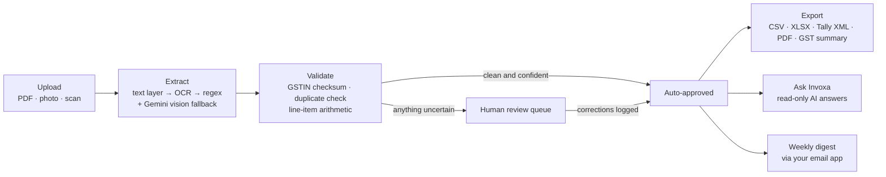
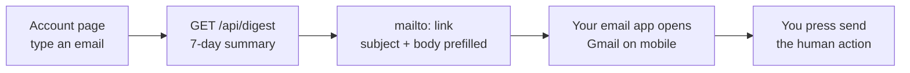
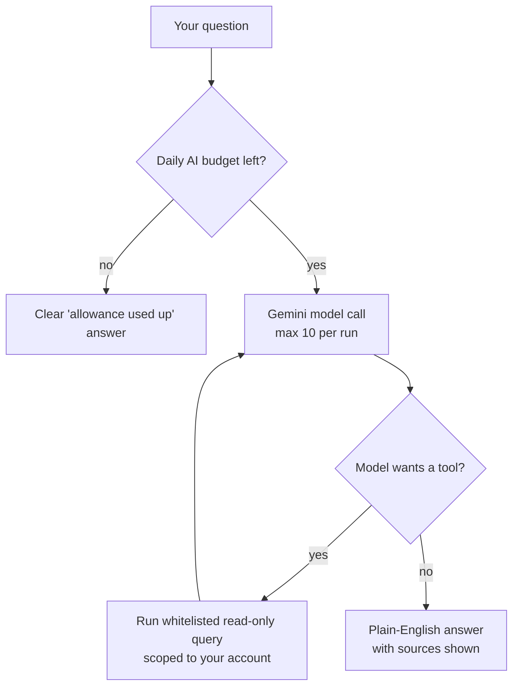

<div align="center">

# Invoxa

**AI-powered invoice & accounts-payable automation for Indian micro-businesses.**

Upload a vendor invoice - Invoxa reads it, validates it, and either books it or hands it to you for a two-second review. Then it answers your questions about your own books.

[](https://github.com/shashwatssp/Invoxa/actions/workflows/ci.yml)


**[Try it live →](https://invoxa4u.vercel.app)**

</div>

---

## Contents

- [What is Invoxa?](#what-is-invoxa)
- [The problem](#the-problem)
- [How it works](#how-it-works)
- [Accuracy, by design](#accuracy-by-design)
- [Humans stay in the loop](#humans-stay-in-the-loop)
- [A tour of the product](#a-tour-of-the-product)
- [Ask Invoxa - your books, in plain English](#ask-invoxa---your-books-in-plain-english)
- [Built-in AI features (all live today)](#built-in-ai-features-all-live-today)
- [Honest limits](#honest-limits)
- [Developer quickstart](#developer-quickstart)
- [License](#license)

---

## What is Invoxa?

This is not meant to replace a finance team. It is meant to be the finance function for businesses that never had one.

A small business owner receives a vendor invoice - a courier receipt photographed on WhatsApp, or a raw-materials supplier's PDF emailed over. Today, that invoice sits in a folder until someone manually opens it, reads it, and types it into Tally.

With Invoxa:

1. They upload the invoice (or share it straight from WhatsApp into the app).
2. Within seconds, the extraction pipeline reads the document and pulls out the vendor name, invoice number, amount, GST number, due date, and line items - each field tagged with a confidence score.
3. The system independently checks: is the GST number valid? Have we seen this exact vendor + number + amount combination before (possible duplicate)? Do the line items actually add up to the total?
4. If everything is clean and high-confidence, the invoice flows straight through. If anything is uncertain, duplicate-flagged, or inconsistent, it's routed to a human review queue - never silently pushed forward.
5. Receipts are organized into **folders** (per client, project, or shop), browsable with one-tap filters, and exportable per folder.
6. The owner opens the **Export Center**, picks a format (CSV, Excel, Tally XML, or a printable PDF statement), a period, a folder, or a hand-picked selection - sees a live preview - and downloads it. Compatible with Tally and Zoho Books imports.

**A back-of-envelope estimate** (assumes ~5–10 minutes of manual work per invoice):

| Business size | Invoices/month | Manual time/month | With Invoxa |
| --- | --- | --- | --- |
| Small | 50 | ~4–8 hours | ~30–60 min |
| Mid | 150 | ~12–25 hours | ~1.5–3 hours |
| Larger micro-SME | 600 | ~50–100 hours | ~6–10 hours |

The realistic promise: a business that spends a full workday a week on invoices gets that down to under an hour - with the remaining time spent only on the handful of items genuinely needing a human eye.

---

## The problem

Indian micro and small enterprises process invoices almost entirely by hand. A vendor invoice arrives as a PDF, a WhatsApp photo, a scan, or an email attachment - in no standard format - and someone has to read it, retype the numbers into Excel or Tally, check it isn't a duplicate, and decide which expense category it belongs to.

Razorpay's [Fix My Itch](https://razorpay.com/m/fix-my-itch/) project - a crowdsourced, verified collection of real problems faced by Indian businesses - highlights exactly this pain:

> **"Why do micro-SMEs waste 10+ hours weekly on invoice management?"**
> - Razorpay, Fix My Itch

The root cause, in three parts:

1. **No standard invoice format** - every vendor sends invoices differently.
2. **No dedicated finance headcount** - a 5-person shop has no accountant checking every line.
3. **Existing AP automation is built for enterprises** - global players (BILL, Stampli, Tipalti) are designed and priced for mid-market finance teams; India-focused spend platforms typically fit businesses with far larger monthly volumes. The 5-person shop - the most common kind of business in India - is left doing data entry.

The manual process isn't just slow - it's unaudited risk. Mis-entered amounts and duplicate payments are invisible until they become a bank transfer.

---

## How it works



## Accuracy, by design

A tool that silently mis-enters a number into someone's books is worse than no tool at all. Invoxa leans on four independent layers rather than trusting the model to be right:

- **Confidence scoring on every field.** Extraction isn't a black box - every value (vendor, amount, GST number, dates) carries a confidence score derived from how it was found: checksum-validated GSTINs and labeled amounts score higher than loose regex hits. Clean invoices score 85–95% and auto-approve; anything below 80% or with a failed validation is flagged, never silently accepted.
- **Rule-based validation, not just AI judgment.** GST numbers are checked against India's actual GSTIN checksum algorithm - a deterministic, non-AI check that either passes or fails. Line items must arithmetically reconcile with the invoice total within a stated tolerance.
- **Cross-referencing against history.** Duplicate detection (same vendor + invoice number + amount) acts as a second, independent error-catching layer that doesn't depend on the extraction being perfect in the first place.
- **Continuous measurement.** Every time a human corrects a field, that correction is logged. Over time this produces a real, measured accuracy rate - not a marketing claim.

The honest framing: the AI won't be 100% accurate at extraction. The system is designed so it doesn't need to be - it needs to know when it might be wrong and hand that specific case to a person.

## Humans stay in the loop

Human involvement is deliberately placed at the points where mistakes are expensive:

- **Review queue for flagged items only** - low-confidence extractions, potential duplicates, and amounts that don't reconcile land in front of a person. Clean, high-confidence invoices never require a human touch.
- **Side-by-side verification** - the original receipt renders right next to the extracted data (page-1 thumbnails in the queue, full document in the viewer), so a human can visually confirm a field in about two seconds.
- **No financial action is ever auto-executed.** The system extracts, flags, and drafts - it does not pay, file, submit, or send anything on its own. A human approves before anything touches payments, exports, or filings.
- **Approval is loud, not silent.** Approving (or correcting) an invoice marks it "reviewed" across the dashboard, digest, and exports immediately.
- **Correction tracking** - every human edit is persisted, feeding the measured-accuracy loop.

## A tour of the product

### Uploads

- **Multi-file uploads with progress** - drop or pick several receipts at once (PDFs and phone photos); each file shows its own processing state and confidence badge, and image-only files are read by the AI vision fallback.
- **Destination first** - choose the folder before uploading; every completed file shows a green "Done · Added to <folder>" marker, and changing the folder after uploading re-files the whole batch with a toast confirmation.
- **Share into Invoxa** - when installed as a PWA, share a PDF or photo straight from WhatsApp, Photos, or Files and it lands on the Upload page, ready to process.

### Review & corrections

- **Self-healing review queue** - flagged invoices always have a pending review item; lost or stale entries are re-enqueued automatically so the dashboard count and the queue always agree.
- **Field-wise correction sheet** - correct several fields in one batch save; every edit is logged as a correction, marks the field human-verified, and updates dashboards and exports immediately.
- **Edit fields anywhere** - invoice number, dates, and amounts can be corrected right on the invoice detail page, not only via the review queue.
- **AI flag explanations** - one tap asks the AI why an invoice was flagged: what likely went wrong, and what to verify before approving.

### Dashboard

- **Stats, search & filters** - free-text search (invoice number and vendor), status filter, and upload-date range, all server-side and combinable; filters re-run without wiping the current view.
- **Due soon (pinned)** - every unpaid invoice due within 5 days, account-wide, overdue ones badged, sorted by date.
- **Monthly spend trend** - bar chart with a 6M/12M range toggle; hover a bar for the exact total and invoice count.
- **Spend by category** - horizontal-bars breakdown per expense category, biggest first; uncategorized rolls up as "other".
- **Bulk actions & pagination** - tick invoices and re-file them in one action; long lists render in pages of 100 with "Show more".

### Folders, vendors & exports

- **Folders** - flat, per-account folders (per client, project, or shop) chosen once per scanning batch and usable as an export scope. Deleting a folder never deletes invoices.
- **Vendors view** - total spend, invoice count, and last invoice date per vendor, sorted by biggest spend, with WhatsApp-text and PDF share.
- **Export Center** - one dialog, every format, any slice of the books, with a live preview ("42 invoices · ₹1,23,456") before download:
  - **CSV** - Tally/Zoho-compatible column layout.
  - **Excel (XLSX)** - native import into Zoho Books, Excel, and Google Sheets.
  - **Tally XML** - Purchase vouchers ready for Gateway of Tally > Import > XML.
  - **PDF statement** - clean printable A4 statement for printing or emailing to a CA.
  - **GST summary** - month-by-month CSV (invoices, taxable value, tax collected) ready for the GST portal or your CA.

  Every export accepts the same optional scope: a period, a status, a folder, or a hand-picked selection - always scoped to the logged-in account.

### Weekly digest, emailed the simple way

The dashboard shows a plain-English weekly summary (what was processed, what needs review, what's due soon). On the **Account** page, type an email address and tap **Open email app**: your email app - Gmail on mobile - opens with the digest already written in the body, and you press send. No SMTP server, no app passwords, no configuration anywhere; sending stays a human action.



### Account, sessions & appearance

- **Bottom tab bar on phones** (Dashboard, Upload, Review, Ask AI, Vendors, Account) - inset at the edges so curved screens never clip labels; Account is always one tap away.
- **Dark mode** - System, Light, and Dark themes; live-tracks device changes and applies before first paint, so there's no flash.
- **Installable app (PWA)** - standalone window, Invoxa icons, offline app-shell fallback, and share-target ingestion.
- **Export my data** - one button downloads the whole account (profile, invoices, folders, review history) as JSON.
- **Terms & Privacy** - plain-English pages linked from the landing footer, including an honest description of what is (and isn't) sent to AI processing.

## Ask Invoxa - your books, in plain English

The **Ask Invoxa** page answers natural-language questions about your own data: "What all money do I owe to others?", "Which vendors owe me money this week?", "How much GST did I pay last month?"



- **Bounded read-only agent.** Questions run through a Gemini function-calling loop over a whitelist of account-scoped, read-only queries - account overview, payables by vendor, due soon, vendor/category/monthly spend, flagged invoices, invoice search, and GST tax summary. The agent can never modify, send, or delete anything; there is no raw text-to-SQL, only intent-based tool calls.
- **Hard safety rails.** Max 8 tool rounds and 10 model calls per run, a daily Gemini budget (default 240 calls/day, resetting midnight IST) with an append-only audit trail, and per-account rate limits on AI-costly endpoints. Transient Gemini failures (429/5xx/timeouts) are retried once with backoff; if the free tier is rate-limited you get a clear, honest message instead of an error.
- **Deterministic where it matters.** "What do I owe?" is answered by the `payables_by_vendor` tool - real unpaid totals grouped per vendor with overdue counts, not model arithmetic.
- **Answers cite their sources.** Each answer shows which tools fed it ("Based on: due_soon, vendor_spend").

There's also **payment reminder drafts**: due and overdue invoices grouped per vendor with an AI-drafted (or template) WhatsApp reminder and a prefilled `wa.me` link. Draft-only by design - nothing is ever sent until you tap the button.

## Built-in AI features (all live today)

Gemini (when `GEMINI_API_KEY` is configured) powers every AI assist below - all already built and shipping in the app, all strictly server-side, and all fully optional: every feature degrades to a deterministic non-AI path when the key is missing or the API fails:

- **Vision fallback for scans and photos.** Image-only PDFs (scans) and photo uploads that produce no extractable text are rendered to bounded-size JPEG page images and sent to Gemini's vision model for extraction, instead of dead-ending as unreadable documents. Low-confidence text extractions also get page images attached for better accuracy.
- **Auto expense categorization.** After extraction, Gemini suggests one expense category (office supplies, travel, software, rent, fuel, …) from a fixed list; it's saved to the invoice, fully editable from the detail page, and carried into exports.
- **AI weekly digest narrative.** On top of the deterministic summary lines, the digest can include a short 2–3 sentence plain-English narrative of the week's activity. It uses only the real numbers from your account - no invented figures - and is silently omitted whenever Gemini is unavailable.
- **Correction-learning extraction.** The last 5 human corrections feed the Gemini fallback prompt as few-shot hints, so extraction accuracy compounds with every fix you make.

The API key never leaves the backend: it is read from `.env` server-side, never exposed to the frontend bundle or any API response.

## Honest limits

Things you should know before evaluating Invoxa:

- **Extraction accuracy is good but not perfect.** That's exactly why every field carries a confidence score and anything uncertain goes to human review. There is room to keep improving accuracy with iteration.
- **"Zoho support" means import-compatible files.** Invoxa generates CSV/XLSX in a layout Zoho Books imports natively. There is no direct Zoho Books API integration (no OAuth, no push).
- **Pricing is planned, not enforced.** The intent is a genuinely usable free tier for the smallest shops (up to 20 invoices/month) rather than a free-trial funnel, scaling to a few thousand rupees a month - but no tier limit is enforced in the code yet.
- **Agent budget/audit tables** (`migrations/0007`) must be applied in Supabase for the daily AI accounting to be active; the agent degrades gracefully until then.

## Developer quickstart

### Backend

```bash
cd backend
pip install -r requirements.txt
uvicorn app.main:app --port 8000
```

Environment variables (copy `.env.example` to `.env` at the repo root):

```
SUPABASE_URL=...
SUPABASE_PUBLISHABLE_KEY=...
SUPABASE_SERVICE_KEY=...
SECRET_KEY=<random 64-hex string; required for stable JWT sessions>
GEMINI_API_KEY=...          # optional, enables the vision fallback and Ask Invoxa
DATABASE_URL=...            # optional, for CLI migrations
```

Apply migrations in your Supabase SQL editor: `migrations/0001_init.sql`, then `0002_auth.sql`, `0003_folders.sql`, `0004_category.sql`, `0005_tax.sql` and `0006_line_items.sql` (0002+ are kept out of the repo - see `.gitignore`; apply with `python scripts/apply_0004.py`, `python scripts/apply_0005.py`, `python scripts/apply_0006.py`, or by hand). `0007_agent_audit.sql` (same local-only convention) adds the agent's daily-budget and audit-trail tables.

### Frontend

```bash
cd frontend
npm install
npm run dev      # http://localhost:5173, API proxied to :8000
```

### Tests & checks

```bash
cd backend && python -m pytest tests -q          # 300+ unit/integration tests
python -m ruff check backend                     # lint
cd frontend && npm run lint && npm run typecheck && npm run build
```

CI runs backend syntax + lint, frontend lint + type check + build, and a gitleaks secret scan on every push.

### End-to-end validation

```bash
cd backend/test-assets
INVOXA_BASE_URL=https://your-deployment.vercel.app python run_e2e.py
```

Signs up two accounts, uploads every test PDF, asserts ground-truth fields, verifies per-account data isolation, ownership enforcement on receipts and previews, the review workflow, duplicate detection, folder-scoped and period-filtered exports, the invoice-list filters, and the digest.

### Deployment

Vercel deploys both halves from one repo, one domain:

- `frontend` - Vite, SPA rewrite for client-side routing.
- `backend` - FastAPI, entrypoint `api/index.py`, function timeout raised to 60s for extraction.

`vercel.json` at the repo root owns all public routing: `/api/*` and `/health` reach the backend, everything else the frontend. Secrets are configured as project environment variables - nothing sensitive is committed.

## License

[MIT](LICENSE) © 2026 Shashwat S Pandey
